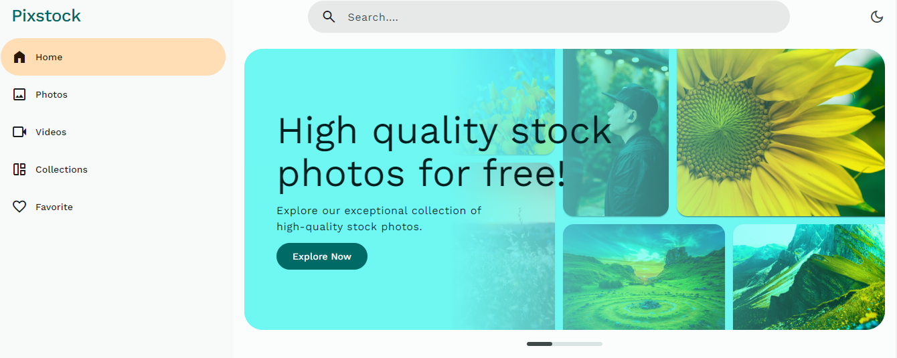
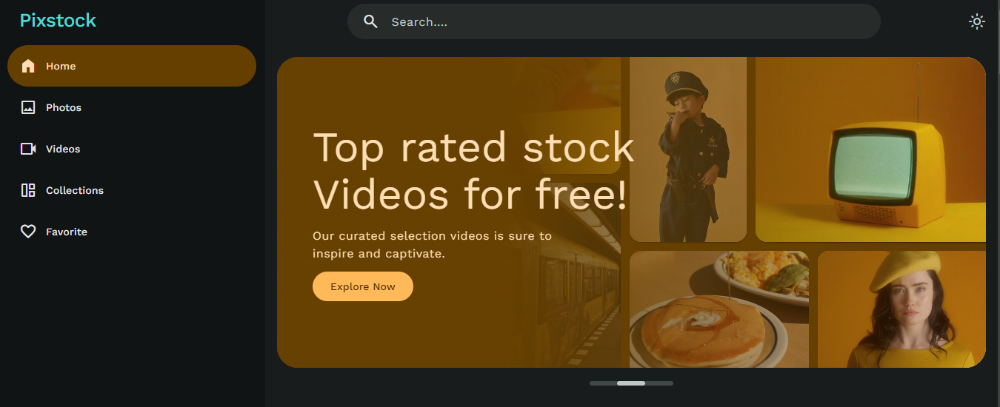
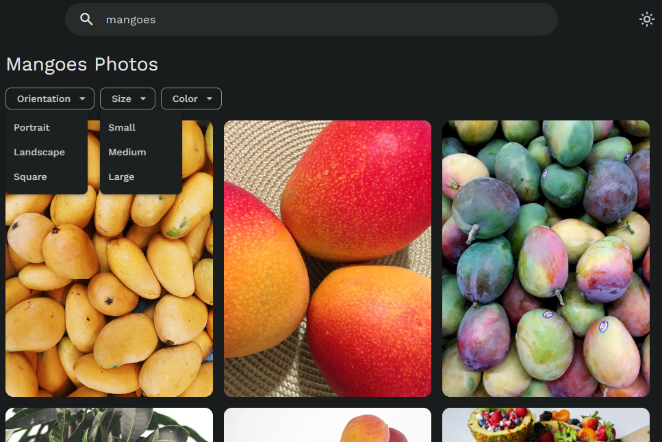

# PicsHub - Pexels Clone

This is a Pexels Clone, a web application that allows users to browse and search for high-quality images and videos using the Pexels API. The application is built using HTML, CSS, and JavaScript and provides five main pages: Home, Images, Videos, Collections, and Favorites.





## Table of Contents

- [Features](#features)
- [Demo](#demo)
- [Setup](#setup)
- [Technologies Used](#technologies-used)
- [Future Plans](#future-plans)


## Features

1. **Home Page**: The landing page of the application, providing a brief introduction and navigation options to other pages.

2. **Images Page**: Displays a grid of images fetched from the Pexels API. Users can browse and search for images using various filters.

3. **Videos Page**: Shows a grid of videos retrieved from the Pexels API. Users can search and explore different video content.

4. **Collections Page**: Allows users to view curated collections of images and videos from Pexels.

5. **Favorites Page**: Users can mark their favorite images and videos and access them later through this page.

## Demo

You can check out the live demo of the application at [https://picsstock.netlify.app/](https://picsstock.netlify.app/)

## Setup

To set up the project locally, follow these steps:

```bash
git clone https://github.com/SunilBarewar/PixsStock.git
```
Navigate to the project directory:
```
cd PixsStock
```

Open the index.html file in your preferred web browser


## Usage

- **Navigation**: Use the top navigation bar to switch between different pages - Home, Images, Videos, Collections, and Favorites.

- **Images**: On the Images page, you can view and search for images using the search bar and various filters (e.g., Popular, Newest, etc.).

- **Videos**: The Videos page lets you explore videos by searching and using filters (e.g., Popular, Newest, etc.).

- **Collections**: View curated collections of images and videos on the Collections page.

- **Favorites**: Mark your favorite images and videos by clicking on the heart icon. Access them later from the Favorites page.

## Technologies Used

- HTML5
- CSS3
- JavaScript (ES6)
- Pexels API

## Future Plans

The future plans for this application include recreating it using React.js to leverage the benefits of a component-based architecture, improved performance, and easier state management. Some of the specific upgrades planned are:

1. **Modular Components**: Redesign the application using React.js to break down the UI into modular components, making the codebase more maintainable and scalable.

2. **Optimized Performance**: Implement efficient rendering and loading techniques to improve the overall performance of the application.

3. **State Management**: Utilize React's state management or integrate a state management library (such as Redux) to manage application-wide data and user interactions effectively.

4. **Improved Search and Filters**: Enhance the search and filtering functionality to provide a seamless user experience when browsing images and videos.

5. **Responsive Design**: Ensure the application is fully responsive across different devices and screen sizes for a consistent experience.

6. **User Authentication**: Consider adding user authentication to enable users to create accounts and save their preferences and favorites.

7. **Interactive User Interface**: Implement interactive elements, such as dynamic image previews and video playback controls, to make the user interface more engaging.


## Credits

The design and development of this Pexels Clone were inspired by and based on the tutorials and explanations provided by the YouTube channel "CodeWithSadee." Visit the channel for insightful web development content.

---

Thank you for using the PixsStock! If you have any questions or feedback, please don't hesitate to contact us. I look forward to bringing you an improved version of the application with the planned React.js upgrade!
